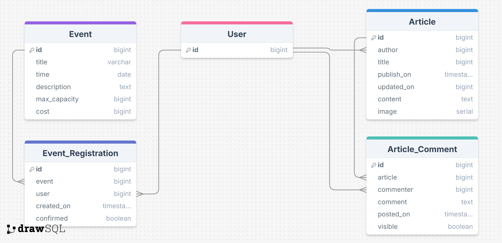

# Milestone Project 4 : The Creative Barn

Code Institute Milestone 4 project by Daniel Rydell

## Introduction

The Creative Barn is a fictious art store, located just outside a small village but still close to one major and several smaller cities. Not the kind of place where you drop in when you have a few minutes; it is a place where you can find anything. The Barn attracts a very loyal and active, though somewhat small, customer group from the surrounding area but Arthur and Tricia (the couple running the Barn part time next to their regular jobs) now want to put more time and focus into their passion, art and creative hobbies.
 
## Goals

While a web shop might seem a normal way to expand their business, Arthur and Tricia does not want to run a post order business, prepare and send packages and so on. Instead, they want to attract customers to their store with events, courses and inspiring articles. They also want to make customers think outside the box (or comfort zone), by supplying secret boxes where customer can choose different themes, for example textile, painting, woodwork and maybe a box aimed at the younger audiences too and then receive a surprise box for that theme four times each year.

## Overview of users and needs

**Store owners**  
- Arthur and Tricia want an attractive web page that presents their store (The Creative Barn) to both new and existing customers
- They want to be able to publish articles about new supplies, creative ideas and other things related to creative hobbies.
- They want to be able to present courses on different themes and crafts and let interested visitors register (and pay) for the events via the web page
- Some events may be free but limited in how many can attend, so registration would be necessary for these events as well even if they don't cost anything
- For the secret boxes, buyers would sign up for a prescription of these via the web page

**Customers**
- Customers would need to register to sign up for courses and events
- Registration will also be required to comment on the articles Arthur and Tricia publish.
- To be able to share ideas, accomplishments and ask questions, a discussion forum or some sort of news feed would be welcomed.

## User stories

The outline above will be refined into user stories with tasks and criteria. Github Projects will be used to keep track of the user stories.

## MVP Priority

Not all functionality will need to be in place upon launch. In order to quickly and within a certain time frame reach a Minimal Viable Product (MVP) that still has value, the following priority will be followed (unless changes or circumstance demand a change)

**Highest priority**
- Post articles and news (can be done through Admin interface to save development time if needed)
- Publish courses and events and let customers sign up (and pay) for them (can be done through Admin interface to save development time if needed)

**Medium priority**
- Comment function on articles, news and events
- Prescription for secret boxes

**Lower priority**
- Discussion forum or news feed
- User interface not requiring the use of admin interface to handle articles and courses

## Basic design of website and page requirements

The website will be constructed using Django and PostgreSQL database. Stripe will be used to facilitate payments. Other framework and tools such as JQuery, Bootstrap etc will be included as necessary

The courses and events will mostly be on different themes and limited to one time each. Therefore, a standard course catalog with different courses and times in one-to-many-relationsships does not make that much sence. Instead, all courses/events should be single instances not associated with categories or similar, but a copy function to reuse occasions that are similar would be helpful.

Courses and events will sometimes have a maximun number of participants, and registration will be done on a first come-first-serve basis. Upon regestering for a course/event, the spot should therefore be reserved for five minutes to complete registration and possibly payment. After five minutes, a spot can no longer be guaranteed but will still be completed if there free spaces.

### Entity Relationship Diagram
First ERD-draft, to visualise how the models would look. The ERD will be refined as user stories are developed into more detail, and lower-priority functions are being implemented.

ERD created with [Draw SQL](https://drawsql.app/)
### Model implementation

### Wireframes
### Colors and fonts

## Deployment
## Testing
## Finished website
## Credits

### Resources used
[Draw SQL](https://drawsql.app/) - Creation of Entity Relationship Diagram

