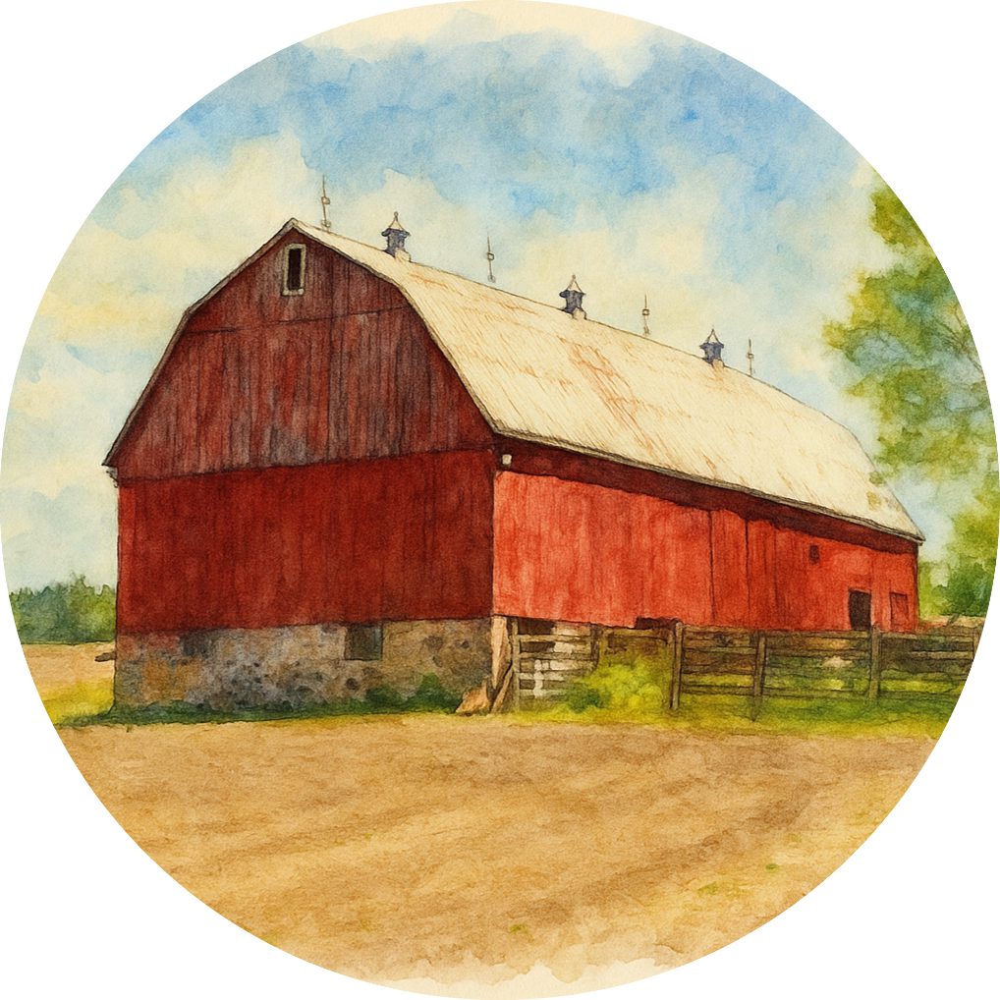
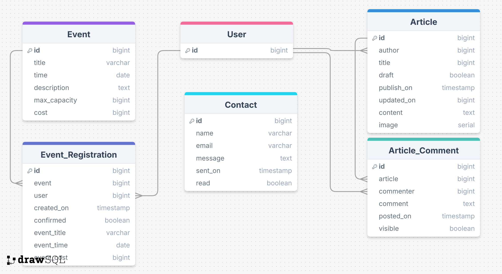
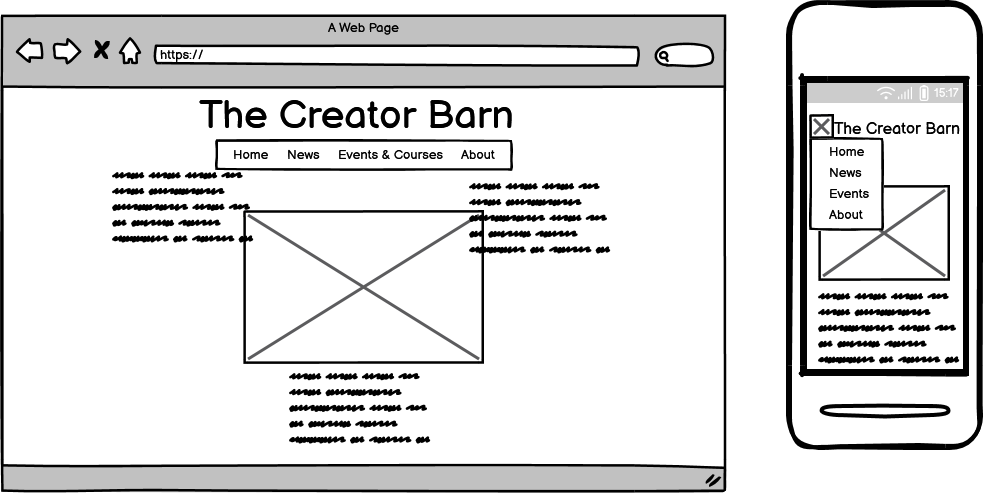
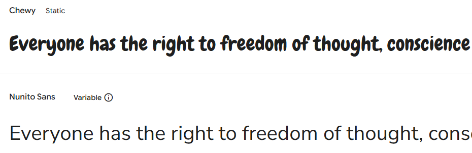

# Milestone Project 4 : The Creators Barn

  
Code Institute Milestone 4 project by Daniel Rydell

Github repository available at [https://github.com/Daniel-R-ci/msp4](https://github.com/Daniel-R-ci/msp4)  
Github Project Board available at [ttps://github.com/users/Daniel-R-ci/projects/8\]](https://github.com/users/Daniel-R-ci/projects/8)  
Heroku deployment available at  
## Table of contents

## Introduction

The Creators Barn is a fictious art store, located just outside a small village but still close to one major and several smaller cities. Not the kind of place where you drop in when you have a few minutes; it is a place where you can find anything. The Barn attracts a very loyal and active, though somewhat small, customer group from the surrounding area but Arthur and Tricia (the couple running the Barn part time next to their regular jobs) now want to put more time and focus into their passion, art and creative hobbies.
 
## Goals

While a web shop might seem a normal way to expand their business, Arthur and Tricia does not want to run a post order business, prepare and send packages and so on. Instead, they want to attract customers to their store with events, courses and inspiring articles. They also want to make customers think outside the box (or comfort zone), by supplying secret boxes where customer can choose different themes, for example textile, painting, woodwork and maybe a box aimed at the younger audiences too and then receive a surprise box for that theme four times each year.

## Overview of users and needs

**Store owners**  
- Arthur and Tricia want an attractive web page that presents their store (The Creators Barn) to both new and existing customers
- They want to be able to publish articles about new supplies, creative ideas and other things related to creative hobbies.
- They want to be able to present courses on different themes and crafts and let interested visitors register (and pay) for the events via the web page
- Some events may be free but limited in how many can attend, so registration would be necessary for these events as well even if they don't cost anything
- For the secret boxes, buyers would sign up for a prescription of these via the web page

**Customers**
- Customers would need to register to sign up for courses and events
- Registration will also be required to comment on the articles Arthur and Tricia publish.
- To be able to share ideas, accomplishments and ask questions, a discussion forum or some sort of news feed would be welcomed.

## MVP Priority 

Not all functionality will need to be in place upon launch. In order to quickly and within a certain time frame reach a Minimal Viable Product (MVP) that still has value, the following priority will be followed (unless changes or circumstance demand a change)

**Highest priority**
- Post articles and news (can be done through Admin interface to save development time if needed)
- Publish courses and events and let customers sign up (and pay) for them (can be done through Admin interface to save development time if needed)

**Medium priority**
- Comment function on articles, news and events
- Discussion forum or news feed

**Lower priority**
- Prescription for secret boxes
- User interface not requiring the use of admin interface to handle articles and courses

## User stories

For fully detailed user stories with criteria and tasks, see [The Barn User Stories](/static/readme/README_user_stories.md)

The user stories are also found and tracked on  [Github Projects](https://github.com/users/Daniel-R-ci/projects/8/)

(MVP) (not included i excerpts below but featured in Github Project) means the criteria/task should be completed before moving on to the next task (and ulitately project submission). When all MVP criteria/tasks are fullfilled, work can start on non mvp-tasks in order of priority.

### Owner: Publish courses and events
As a _business owner_, I would like to _publish information about upcoming courses and events_ to _let customers now about them and to eventually let them sign up for them_.

Priority: High

### Owner: Post articles / news

As a _business owner_, I would like to _publish news about new supplies, craft tips etc_, to _inspire future craft projects and bring more customers to the store_.

Priority: High

### Customer: User registration
As a _customer_, I would like to _register a user account_ in order to _take advantage of the online fuctions being offered_

Priority: High

### Customer: Course and event registration

As a _customer_, I would like to be able to _register for upcoming courses and events_ in order to _secure a spot at those that interest me_

Priority: High

### Customer: Comment on articles
As a registered user, I would like to be able to _comment on articles and news_ posted on the website in order to _provide feedback to the store_.

Priority: Medium

### Customer: Post information about own projects or ask questions

As a _registered user_, I would like a way to _show my projects or ask craft related questions_ in order to _receive feedback and interact more withthe creative community around The Barn._

Priority: Medium

### Owner: Inforamtion and contact

As a _business owner_, I need a way to _give general information about my store, as well as a way to let customers contact us_ in order to _provide expected customer service_.

Priority: Medium

### Customer: Sign up for secret box subscription

As as _customer_, I would like to _register for The Barns secret craft boxes_ in order to _try new creative areas of the craft hobby that I would not otherwise have considered_.

Priority: Low

## Developers reminder

While not a user story, this list resides in Github Projects with the user stories and serves as a developer's reminder of overall goals, tasks and things that need to be checked off before project submission. Things will be added during the entire project as issues arise.

### Tasks included from the project start

- Create a responsive web page using Bootstrap and Django 
- Validate all Javascript code
- Validate all Python code
- Validate all rendered html pages
- Create Lightroom report

### Tasks included during project

## Basic design of website and page requirements

The website will be constructed using Django and PostgreSQL database. Stripe will be used to facilitate payments. Other framework and tools such as JQuery, Bootstrap etc will be included as necessary

The courses and events will mostly be on different themes and limited to one time each. Therefore, a standard course catalog with different courses and times in one-to-many-relationsships does not make that much sence. Instead, all courses/events should be single instances not associated with categories or similar, but a copy function to reuse occasions that are similar would be helpful.

Courses and events will sometimes have a maximun number of participants, and registration will be done on a first come-first-serve basis. Upon regestering for a course/event, the spot should therefore be reserved for five minutes to complete registration and possibly payment. After five minutes, a spot can no longer be guaranteed but will still be completed if there free spaces.

### Outline of apps to be developed

- **Home**, entry site. Will eventually rely on other apps to provide information about what is happening at The Barn
- **Events** (name chosen for events/courses). Will handle display and and registration of all events, both those that are free and those who require payments.
- **Blog** (name chosen for news/articles). A blog function where The Barn can post news and inspiring articles not directly related to specific events.
- **About**. Contact form and information about The Barn

**Considerations made during app development**
- Information sent with the contact form in About app will be saved in the database to be reviewed there. On a live website for this kind of business, it would probably make more sense to send an email to a specific mailbox but since the functions will be tested by CI assessors, and possibly used for other demonstration purposes, sending these emails to a live email adress makes little sense.

### Entity Relationship Diagram
Latest ERD used in project. Some field types may differ from actual model due to difference in available types in tool used ([Draw SQL](https://drawsql.app/)). Id fields will be specified in models but implemented by Django, shown in ERD for relationshsip purposes.

**List of all ERDs created during project**  
(from oldest to newest)  
- [ERD version 0.1](static/readme/images/erd_0_1.png), first draft to visuallise how the models could look and their relationships
- [ERD version 1.0](static/readme/images/erd_1_0.png), updated with Contact and draft field in Article. Used to start model creation in Django.
- [ERD version 1.1](static/readme/images/erd_1_1.png), add fields to event_registration for historical views if original event is deleted
- [ERD version 1.2](static/readme/images/erd_1_1.png), add image_url field to Article to make use of Botutique_ADO AWS code. Also include same image field in Article_Comment to allow users to include images in their replies.
- [ERD version 1.2]

### Model implementation

### Wireframes

Wireframes were constructed for each app before work started on each Django app. By not constructing all wireframes at once, the first views served as a test to see if the proposed layout worked before starting on new wireframes, apps or views.

### Home view

### Colors and fonts

Fonts were chosen from Google Fonts. Criteria for selection was finding fonts that gave an artistic but still serious and easy to read headlines, and a relaxed easy to read style for other text. The fonts Chewy and Nunito Sans were found matching the needs.  

Colors where chosen with the help of [Coolors.co](https://coolors.co/) by uploading the home image and picking matching colors for different purposes. The first finished views/pages were tested for constrast and clarity using <--- VALIDATORS GOES HERE --->
  
From left to right:  
Jasmine: #f5d389; Background color
Dark-moss-green: #5f5c1e; Header and footer
Light-blue: #a5c5cc; Text on dark background
Black: #00000f; Regular text
Rust: #bf3d1f;  

## Considerations, and alternative ideas considered or tried

- **Saving historical data**  
  The fields for event_title, event_time and event_cost in the Event_Registration model may seem like a duplicate of data already stored in a corresponding Event.
   This is to preserve order history, in case the corresponding event post gets deleted. The custumer/user will still be able to see this in his/her order history, even if more detailed information is no longer available.
- **To paginate, or not to paginate**  
  Pagination of data, like blog posts, offer both advantages and disadvantages. Advantages include faster load times (less data/page to generate) and also reduced congnitive load on user since there is less data to take in at once. Disadvantages can occur with disruptive user flow to users who are used to scrolling, requiring more clicks to reach a particular post, and more interaction clicks needed to reach some content.  
  In this project, the decision was made to go ahead with pagination for blog feeds, like news and articles. This was done both to reduce scrolling, especially on mobile devices, but also as a learning experience since the student (me, Daniel) didn't use pagination in previous Milestone Project even if it was considered.
  Twelve posts per page seemed like the logical number of posts on each page since 1,2,3 or 4 posts are shown on each row depending on screen sizes, and 12 is the first product in common.

## Project log

Apart from the projects complete Github commit history, the following are a log of projects major steps:

- **June 23, 2025** Project formally started with introduction, basic outlines of goals and session with Code Insitute mentor Spencer Barriball.
- **June 25, 2025** Set up development enviroment, including (among others) venv, PostgreSQL and .gitignore
- **June 30, 20225** Deployment to Heroky to test config variables and database connection

## Deployment

### Deployment strategies
The project was deployed to Heroku fairly quickly and new deployment has been made continuosly after first developing and testing new functions locally.  
Another option would have been to complete all or major parts of the project locally and then deploy to Heroku, as with the Boutuiqe Ado-project. Early deployment was favored for testing purposes and not risking getting stuck late in the project with issues that could have been resolved earlier or step by step. This is also in line with the recommendations from Code Institute.  
Another choice was to use the same PostgreSQL database throughout development or use separate development and production database (as also demonstrated in Boutique Ado project). The decision was made to use the same PostgreSQL database at all time, on the fact deployments to Heroku would be made on regular basis for testing and then it would make sence to have both development and production using the same data. This would make it easier to know if potential bugs or errors was caused by faulty/inconcistent data or by buggy code.  
Other choices could have been made in bigger projects, or with mulitple developers working on differnt parts of the projects. Also, another factor would be if the deployed version would be used by real users while development continues on functions with lower priority.

### Deployment process

- Set up Github repository
- Frequent commits to Github during development
- Deployment to Heroku:
  - Install gunicorn and update requirements.txt
  - Create Procfile, .python-version
  - Commit changes to Github
  - Create new Heroku app
  - Set up Heroku config variables described in [Config Variables](static/readme/README_config_variables.md)
  - Connect Heroku app to github repository
  - Deploy project from main branch
  - Setting up Amazon Web Serive for Static and Media files
    - Set up AWS S3 Bucket, following instructions in Code Institue Boutique_Ado lesson. Setup includes
      - Create S3 Bucket
      - Create User Group
      - Set up Policy
      - Create User
  - Set up static files location, according using custom_storage.py, as shown in Code Institue Boutique_Ado lesson.
  - Add DEPLOYED config var to Heroku with value True
  - Redeploy as necessary for testing

### Difference between development and deployed versions

The development and deployed versions are the same, with the following exceptions:

Sensitive data, such as private keys and enviroment-specific settings are stored in file env.py, which is not committed to Github. In Heroku, these settings are istead stored in config variables.  
A complite list of the data stored this way can be viewed in [Config Variables](static/readme/README_config_variables.md)

Not all files or folders are pushed to Github, either due to security reasons as outlined above, or they are enviromental folders not needed for deployment. A complete list of files and folders not pushed to Github can be found in the .Gitignore file.

## Testing
## Notable bugs found during development or testing

### Setting up AWS

Setting up AWS proved a bit tricky, it turned out the problem was some settings in Boutique_Ado project couldn't be used since that is made in Django 3 and The Barn is made with Django 5. Code Institute tutor support quickly found what was causing the error and showed how the settings would be done in Django 5.

## Finished website
## Credits

- Code Institute mentor Spencer Barriball - for guidelines, support and encouragement
- Code Institute tutor support Oisin - for help with storage settings using AWS
- Fellow Code Institute students Patrik L and Jere H for support, encouragement and sounding boards
- Django 5 By Example, by Antonio Melé

### Framework , resources and libraries used in project

For a complete list of installed packages and versions, see [requirements.txt](requirements.txt)

### Forums and guides 

### Resources and tools used
- [ChatGPT](https://chatgpt.com/) - Used for the following purposes:
  - Make a painting out of photograph for use home page
- [Coolors.co](https://coolors.co/) - Choosing a suitable color palette from a chosen image
- [Draw SQL](https://drawsql.app/) - Creation of Entity Relationship Diagram
- [Fotor.com](https://www.fotor.com/) - Online photo editor used to adjust size and quality of images
- [Unsplash.com](https://unsplash.com/) - for images used in project

