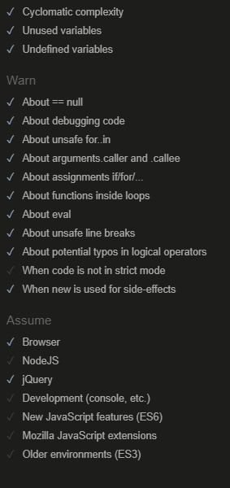
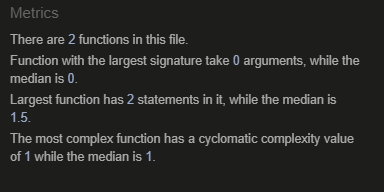

# Milestone Project 4 : The Creativity Barn

  
Code Institute Milestone 4 project by Daniel Rydell

Github repository available at [https://github.com/Daniel-R-ci/msp4](https://github.com/Daniel-R-ci/msp4)  
Github Project Board available at [https://github.com/users/Daniel-R-ci/projects/8/](https://github.com/users/Daniel-R-ci/projects/8)  
Heroku deployment available at [https://dr-ci-msp4-87974008a79d.herokuapp.com/](https://dr-ci-msp4-87974008a79d.herokuapp.com/)

## Table of contents

## Introduction

The Creativity Barn is a fictious art store, located just outside a small village but still close to one major and several smaller cities. Not the kind of place where you drop in when you have a few minutes; it is a place where you can find anything. The Barn attracts a very loyal and active, though somewhat small, customer group from the surrounding area but Arthur and Tricia (the couple running the Barn part time next to their regular jobs) now want to put more time and focus into their passion, art and creative hobbies.
 
## Goals

While a web shop might seem a normal way to expand their business, Arthur and Tricia does not want to run a post order business, prepare and send packages and so on. Instead, they want to attract customers to their store with events, courses and inspiring articles. They also want to make customers think outside the box (or comfort zone), by supplying secret boxes where customer can choose different themes, for example textile, painting, woodwork and maybe a box aimed at the younger audiences too and then receive a surprise box for that theme four times each year.

## Overview of users and needs

**Store owners**  
- Arthur and Tricia want an attractive web page that presents their store (The Creativity Barn) to both new and existing customers
- They want to be able to publish articles about new supplies, creative ideas and other things related to creative hobbies.
- They want to be able to present courses on different themes and crafts and let interested visitors register (and pay) for the events via the web page
- Some events may be free but limited in how many can attend, so registration would be necessary for these events as well even if they don't cost anything
- For the secret boxes, buyers would sign up for a prescription of these via the web page

**Customers**
- Customers would need to register to sign up for courses and events
- Registration will also be required to comment on the articles Arthur and Tricia publish.
- To be able to share ideas, accomplishments and ask questions, a discussion forum or some sort of news feed would be welcomed.

## MVP Priority 

Not all functionality will need to be in place upon launch. In order to quickly and within a certain time frame reach a Minimal Viable Product (MVP) that still has value, the following priority will be followed (unless changes or circumstance demand a change)

**Highest priority**
- Post articles and news (can be done through Admin interface to save development time if needed)
- Publish courses and events and let customers sign up (and pay) for them (can be done through Admin interface to save development time if needed)

**Medium priority**
- Comment function on articles, news and events
- Discussion forum or news feed

**Lower priority**
- Prescription for secret boxes
- User interface not requiring the use of admin interface to handle articles and courses

## User stories

The fully detailed user stories, including tasks and criteria, see [Github Projects](https://github.com/users/Daniel-R-ci/projects/8/) which shows an up to date view of the entire project.

(MVP) (not included in excerpts below but featured in Github Project) means the criteria/task should be completed before moving on to the next user story (and ulitately project submission). When all MVP criteria/tasks are fullfilled, work can start on non mvp-tasks in order of priority.

### Owner: Publish courses and events
As a _business owner_, I would like to _publish information about upcoming courses and events_ to _let customers now about them and to eventually let them sign up for them_.

Priority: High

### Owner: Post articles / news

As a _business owner_, I would like to _publish news about new supplies, craft tips etc_, to _inspire future craft projects and bring more customers to the store_.

Priority: High

### Customer: User registration
As a _customer_, I would like to _register a user account_ in order to _take advantage of the online fuctions being offered_

Priority: High

### Customer: Course and event registration

As a _customer_, I would like to be able to _register for upcoming courses and events_ in order to _secure a spot at those that interest me_

Priority: High

### Customer: Comment on articles
As a registered user, I would like to be able to _comment on articles and news_ posted on the website in order to _provide feedback to the store_.

Priority: Medium

### Customer: Post information about own projects or ask questions

As a _registered user_, I would like a way to _show my projects or ask craft related questions_ in order to _receive feedback and interact more withthe creative community around The Barn._

Priority: Medium

### Owner: Inforamtion and contact

As a _business owner_, I need a way to _give general information about my store, as well as a way to let customers contact us_ in order to _provide expected customer service_.

Priority: Medium

### Customer: Sign up for secret box subscription

As as _customer_, I would like to _register for The Barns secret craft boxes_ in order to _try new creative areas of the craft hobby that I would not otherwise have considered_.

Priority: Low

### Developers reminder

While not a user story, this list resides in Github Projects with the user stories and serves as a developer's reminder of overall goals, tasks and things that need to be checked off before project submission. Things will be added during the entire project as issues arise.

## Basic design of website and page requirements

The website will be constructed using Django and PostgreSQL database. Stripe will be used to facilitate payments. Other framework and tools such as JQuery, Bootstrap etc will be included as necessary

The courses and events will mostly be on different themes and limited to one time each. Therefore, a standard course catalog with different courses and times in one-to-many-relationsships does not make that much sence. Instead, all courses/events should be single instances not associated with categories or similar, but a copy function to reuse occasions that are similar would be helpful.

Courses and events will sometimes have a maximun number of participants, and registration will be done on a first come-first-serve basis. Upon regestering for a course/event, the spot should therefore be reserved for five minutes to complete registration and possibly payment. After five minutes, a spot can no longer be guaranteed but will still be completed if there free spaces.

### Outline of apps to be developed

- **Home**, entry site. Will eventually rely on other apps to provide information about what is happening at The Barn
- **Events** (name chosen for events/courses). Will handle display and and registration of all events, both those that are free and those who require payments.
- **Blog** (name chosen for news/articles). A blog function where The Barn can post news and inspiring articles not directly related to specific events.
- **About** Contact form and information about The Barn
- **User_Profile** Lets a user see and update user information.

### Considerations made during development, other ideas considered or tried
- **Notification when contact form is submitted**  
  Information sent with the contact form in About app will be saved in the database to be reviewed there. On a live website for this kind of business, it would probably make more sense to send an email to a specific mailbox but since the functions will be tested by CI assessors, and possibly used for other demonstration purposes, sending these emails to a live email adress makes little sense.

- **Required first and last name**  
  Django AllAuth have been used for user account handling. Since The Barn administrators would like to know the full name of those registering for courses or events, only username and email is not enough.  
  It was quickly discovered that AllAuth settings does not allow these fields by simple settings change, but a custom form is required. Instead of dwelving into this area before MVP launch, an alternate solution was implemented where in base.html a check if performed to see if the user is logged in, but first name is missing. If true, the user is sent to a second registration page to complete the registration. This works for all pages that might be manually entererd or bookmarked, the only excepts are the name registration page and the logout page.
  Since this solution uses Javascript on the client side, it should be complemented by server side checks in the different views. Howerver, for MVP launch it is considered adequate, with server side checks mentioned in backlog for future development.

- **Saving historical data**  
  The fields for event_title, event_time and event_cost in the Event_Registration model may seem like a duplicate of data already stored in a corresponding Event.
   This is to preserve order history, in case the corresponding event post gets deleted. The custumer/user will still be able to see this in his/her order history, even if more detailed information is no longer available.  

- **To paginate, or not to paginate**  
  Pagination of data, like blog posts, offer both advantages and disadvantages. Advantages include faster load times (less data/page to generate) and also reduced congnitive load on user since there is less data to take in at once. Disadvantages can occur with disruptive user flow to users who are used to scrolling, requiring more clicks to reach a particular post, and more interaction clicks needed to reach some content.  
  In this project, the decision was made to go ahead with pagination for blog feeds, like news and articles. This was done both to reduce scrolling, especially on mobile devices, but also as a learning experience since the student (me, Daniel) didn't use pagination in previous Milestone Project even if it was considered already then.
  Twelve posts per page seemed like the logical number of posts on each page since 1,2,3 or 4 posts are shown on each row depending on screen sizes, and 12 is the first product in common.  

- **Storage of media and static files**  
  The choice stood between storing uploaded images on Cloudinary or Amazon Web Service (AWS), and to store static files and images with the deployed files on Heroky or use AWS for these as well.
  AWS was choosen for both uploaded files and static files for two reasons. One was a way to build on what was learned in previous learning projects but in a newer version av Django (since there was known to be some differences), and also to be able to show larger variety in techniques and skills to potential employers if Milestone Projects are to be used as portfolio projects.

- **Removing possibility to post images in blog comments**  
  Nearing project submission, the decision was made to remove the feature to include images in blog comments. The idea was for The Creative Barn to be able to make a blog post on a certain theme, and then ask their visistors to contribute with pictures on their own relating projects. Unofrtunately there was no time to include constraints for file size, image size and style pictures with different proportions to look good. Since the "public blog", where users could post their own pictures and project, wouldn't be included in project submission picture upload for other than staff was removed. The features would still be a welcome adition to the site, and is noted in Future development ideas at the end of this file.


### Entity Relationship Diagram and Models
Latest ERD used in project. Some field types may differ from actual model due to difference in available types in tool used ([Draw SQL](https://drawsql.app/)). Id fields will not be specified in models but implemented by Django, shown in ERD for relationshsip purposes.

  

[Overview of all models as implemented in Django](static/readme/README_models.md)

**List of all ERDs created during project**  
(from oldest to newest)  
- [ERD version 0.1](static/readme/images/erd_0_1.png), first draft to visuallise how the models could look and their relationships
- [ERD version 1.0](static/readme/images/erd_1_0.png), updated with Contact and draft field in Article. Used to start model creation in Django.
- [ERD version 1.1](static/readme/images/erd_1_1.png), add fields to event_registration for historical views if original event is deleted
- [ERD version 1.2](static/readme/images/erd_1_2.png), add image_url field to Article to make use of Botutique_ADO AWS code. Also include same image field in Article_Comment to allow users to include images in their replies.
- [ERD version 1.3](static/readme/images/erd_1_3.png), in Events model: fields image, published and published_on has been added to allow images and control when news are published, same as with blog posts.
- [ERD version 1.4](static/readme/images/erd_1_4.png), in Article and Article_Comment, remove image_url fields, and in Article_Comment change commenter to user to better correspond with actual model name
- [ERD version 1.5](static/readme/images/erd_1_5.png) , removed image in Article_Comment

### Wireframes

Wireframes were constructed for most apps before work started on the respective Django app. By not constructing all wireframes at once, the first views served as a test to see if the proposed layout worked before starting on new wireframes, apps or views. Some minor changes where made to the header and menu area for better clarity and user experience.

**Home app**  
  
Home page, index view when arriving to website

**Blog app**  
  
List of blog entries, paginated

  
Blog entry

**Events app**  
  
List of events and courses, paginated

**About app**
Wireframe mockup was not deemed necessary for this simple information page with contact form

**User_Profile app**
Wireframe mockup was not deemed necessary for these simple forms

### Colors and fonts

Fonts were chosen from Google Fonts. Criteria for selection was finding fonts that gave an artistic but still serious and easy to read headlines, and a relaxed easy to read style for other text. The fonts Chewy and Nunito Sans were found matching the needs.  


Colors where chosen with the help of [Coolors.co](https://coolors.co/) by uploading the home image and picking matching colors for different purposes. The first finished views/pages were tested for constrast and clarity using <--- VALIDATORS GOES HERE --->. After validation, testing and demonstration it was decided that the color palette needed to be changed. Again, Coolors.co was used for this and the existing palette is:  

  
From left to right:  
- Barn-red: #701005; Headlines
- Wheat: #f3e2b4; Body background
- Coyote: #906f3d; Shadowbox-effect
- Brunswick-green: #034c3c; Header and footer
- Carolina-blue: #76afd1; Used on some borders for accent

Bootstrap button style secondary was choosen as a good match for the styling on most of the website, with some confiramtion buttons using bootstrap primary button style.

[Original color palette](static/readme/images/palette_1_0.png)

## Project log

Apart from the projects complete Github commit history, the following are a log of projects major steps:

- **June 23, 2025** Project formally started with introduction, basic outlines of goals and mentoring session with Code Insitute mentor Spencer Barriball.
- **June 25, 2025** Set up development enviroment, including (among others) venv, PostgreSQL and .gitignore
- **June 30, 20225** Deployment to Heroky to test config variables and database connection
- **July 17, 2025** Midpoint mentoring session
- **July 20, 2025** Final mentoring session
- **Juky 22, 2025** Project submission

## Deployment

### Deployment strategies
The project was deployed to Heroku fairly quickly and new deployment has been made continuosly after first developing and testing new functions locally.  
Another option would have been to complete all or major parts of the project locally and then deploy to Heroku, as with the Boutuiqe Ado-project. Early deployment was favored for testing purposes and not risking getting stuck late in the project with issues that could have been resolved earlier or step by step. This is also in line with the recommendations from Code Institute.  
Another choice was to use the same PostgreSQL database throughout development or use separate development and production database (as also demonstrated in Boutique Ado project). The decision was made to use the same PostgreSQL database at all time, on the fact deployments to Heroku would be made on regular basis for testing and then it would make sence to have both development and production using the same data. This would make it easier to know if potential bugs or errors was caused by faulty/inconcistent data or by buggy code.  
Other choices could have been made in bigger projects, or with mulitple developers working on differnt parts of the projects. Also, another factor would be if the deployed version would be used by real users while development continues on functions with lower priority.

### Deployment process

- Set up Github repository
- Frequent commits to Github during development
- Deployment to Heroku:
  - Install gunicorn and update requirements.txt
  - Create Procfile, .python-version
  - Commit changes to Github
  - Create new Heroku app
  - Set up Heroku config variables described in [Config Variables](static/readme/README_config_variables.md)
  - Connect Heroku app to github repository
  - Deploy project from main branch
  - Setting up Amazon Web Serive for Static and Media files
    - Set up AWS S3 Bucket, following instructions in Code Institue Boutique_Ado lesson. Setup includes
      - Create S3 Bucket
      - Create User Group
      - Set up Policy
      - Create User
  - Set up static files location, according using custom_storage.py, as shown in Code Institue Boutique_Ado lesson.
  - Add DEPLOYED config var to Heroku with value True
  - Redeploy as necessary for testing

### Difference between development and deployed versions

The development and deployed versions are the same, with the following exceptions:

- Sensitive data, such as private keys and enviroment-specific settings are stored in file env.py, which is not committed to Github. In Heroku, these settings are istead stored in config variables. 
- Static files, such as css, javascript files etc are in development running directly from the development folder, but the deployed version uses Django Collectstatic to save these files to AWS and fetching them from there. The config variable Deployed set to True in Heroku is used in settings.py to differentiate between development and deployed configurations. There is no equivalant setting in env.py 
- In development version, emails are printed to Terminal. In deployed version, a gmail account belonging to Daniel Rydell and used for web development purposes has been used.
- Stripe, development and deployed versions are running on different Stripe Webhook keys. The development version needs to have Stripe CLI running in a terminal window. Stripe endpoint should point to ***deployed-server.com/events/wh/***
A complete list of settings stored in env.py and Heroku Config vars can be viewed in [Config Variables](static/readme/README_config_variables.md)

Not all files or folders are pushed to Github, either due to security reasons as outlined above, or they are enviromental folders not needed for deployment. A complete list of files and folders not pushed to Github can be found in the .Gitignore file.

## Stripe integration and registration flow

There are several payment services that could for a project like this. This project uses Stripe, to take full advantage of both Code Institute lessons and reference book Django 5 by Example.

For future projects, focusing on the Swedish market, other alternativt that would be looked into would be Zettle, Klarna or Mondido.

### Registration and payment flow

1. User clicks to register a course/event with available spots
2. A second check is made to make sure there still is an available spot. Another user could have been faster to click register while the first user is looking or checking the calender. The booking is made with a time stamp, and is unconfirmed.
3. If it is a free event, the booking is immediately confirmed and the user is sent to a confirmation page (flow stops here).
4. An online form for card payment is shown. Stripe JS functions initialize and sends a payment_intent to Stripe.
5. A five minute countdown timer commences (Javascript). Payment must be completed within five minutes, or user is sent to previous page and redo registration from step 1. The preliminary booking is removed.
6. If Stripe payment succeeds, registration is marked as complete and user is sent to confirmaton page.
7. To account for browser closing/crashing after Stripe has confirmed payment but before registration is confirmed, Stripe sends a webhook which the website is listening for.  
8. When webhook is received, a check is made to see if the order is marked as confirmed. If so, nothing more happens (flow stops here).
9. If registration exists but is not marked as confirmed, it is confirmed. (flow stops here).
10. If registration no longer exists (can happen after more than five minutes, or if user tries to register again for the same event before first reegistration is confirmed), a refund will be issued throguh Stripe. The user has to register again.

## Testing

### Testing procedures

Manual testing has been used over automated testing due to time constraints. All functions has been tested as developed, both locally on development server and after deployment to Heroku.

Testing steps include, but not limited to
- Testing all functions as they are being developed
- Registering a new user
- Trying to register a new user with the same name as an existing one
- Viewing blog posts
- Commenting on blog posts, editing and deleting comments
- Registration to events
- Using browsers back function or manually entering urls to check for unwanted behaviour.
- Test again, since even small changes sometimes accidentally caused unexpected and undesired behaviour

### HTML Validation
All rendered html pages was tested with [W3 html validator](https://validator.w3.org/nu/)

**Warnings/errors caught and solved**  
  
This warning occured on all pages due to using h1 tag in the header. The h1 was replaced with a div using the already existing class .header-title. Some additional css styling had to be applied to make look like the previous h1 tag.


  
Error in blog_list.html due to an unclosed div tag. Tag closed.  


  
Occured on several pages where form action="" was set. Although commonly used, this is not according to html standard. The solution was to simply delete the action method.  


  
In event_registration.html there are two Bootstrap Modals for different purposes. The id of the modals (copied from Bootstrap) where changed upon implementation, but not the ID of all elements in the modal. Id changed in both modals to easily distinguish them.  


In user_profile.html, there had been some misplace thead-tags, and depending on the data being printed there was also some instances of a colspan being longer than the actual number of columns used. Columns where reworked, or totally omitted if there was no data to be shown.  

### Lighthouse report

All Chrome Lighthouse reports are from the deployed version at Heroku.com, using Incognito mode.

All Lighthouse reports are available in the separate [Lighthouse reports](/static/readme/README_lighthouse.md) document.

**Test score evaluation**
- The drop in SEO when showing blog posts and events is due to the standard "Read more" buttons, and not using more specific descriptions. Using other descriptions would however cause a more distracting appearance unless care would be taken to show all buttons still a uniform size. The choice of using id instead of slugs has already been discussed earlier.  
  A google search has shown that there are ways to include slugs for better SEO rating but still using the id for identification and retrieval, using urls like ***/blog/4-New open times during summer*** which should solve the problem. It has been noted in backlog / future development.
- The drop in Assesibility in event_registration is due to a aria-hidden setting in a bootstrap modal. The decision was to leave this alone rather than risk unwanted behaviour in a third party component.
- Not surprisingly, event_registration has the lowest performance. This is due to the STRIPE payment implemented on this page but the performance is still within acceptable limits.
- Assesibility was first somewhat low on the blog_list view. This was due to insufficient contrast between the comment symbol and counter. This was adjusted to reach full assesibility score.

### Javascript Validation

There are three justom-made Javascript files in the project. All custom-made Javascripts has been tested using [JSHINT.COM](https://jshint.com/).

The files contain a mix of JQuery and standard JS which may not be optimal. Many JS functions are from different sources found online (and credited where used) but custom-made scripts or adaptations mostly use Jquery. No major effort has been put into rewriting scripts found online to use Jquery instead of standard JS, hence the mix.

Settings used during validation shown below  


External JS files assume that certain constants are declared in other places before calling the JS file. 
Bootstrap, Jquery and Stripe is included in the base.html template, and assumed to be recognized anywhere.  
The use of asychnronus functions in some scripts also assumes ES8 standard. JSHint is told this with the inclusion of  
````
/* jshint esversion: 8 */
````
at the top of every js file. 
Objects, variables or constants are declared using global where needed, for example
````
/* global timeoutUrl, stripePublicKey, clientSecret, bootstrap, Stripe */
````

**base.js**  
  
**blog_post.js**  
  
**event_registration.js**  


### Python validation

Flake 8 was installed and used to find any remaining linting problems that remained after manually going through the files. Some linting errors remain and all in the form of django.*something* imported but unused. These are all from files created by Django and has not been edited at all during the project. Those files are all models.py and admin.py (in apps that don't use any own models) and tests.py, since no automated testing has been performed.

The command ***python -m flake8 --exclude .venv,migrations*** was used to exclude files in the .venv and migrations folder, as recommended in CI Boutique Ado lessons.


noqa comments have been used sparingly, and only on settings or url files where breaking up the lines could lead to loosing overview or making it harder to compare lines.

While using both # comments and docstrings may seem like unneccesary redundancy, this is a deliberate choice to make work in Visual Studio Code easier. When collapsing a function that does not need work, the comment still makes it easy to see and remember what the function does.

````
# Contains one blog article
class Article(models.Model):
    """
    Containes one blog article
    """
    ...
    ...
````
````
# Contains one blog article
class Article(models.Model):...

# Contains one comment on specific article
class Article_Comment(models.Model):...
````

[CI Python Linter](https://pep8ci.herokuapp.com/) could have been used as in previous MS3 project with copying the code from all relevant files, but using Flake 8 this way ensures that no file was missed.

### Notable bugs found during development or testing

- Back to previous page from event_details

### Constantly reloading pages when logging in as a new user
**Problem:** First time logging in as a new user, a script meant to send users to the view request_name sent the browser into a refresh loop
**Solution:** The corresponing name in user_profile urls file had been changed and the script hadn't been tested after that. After looking over all urls names the function again works as intended.

### Files not uploading when commenting on blog posts
**Problem:** Image files not uploading when user attaches a file to a blog post comment
**Solution:** Googling revealed that the form used for uploading the files should have the attribute ***enctype="multipart/form-data"***. [Django Documentation](https://docs.djangoproject.com/en/5.2/topics/http/file-uploads/#basic-file-uploads)

### Bootstrap toasts not showing
**Problem:** Bootstrap toasts not showing as expected, sometimes causing error
**Solution:** This was due to JS/JQUERY code used in Boutique_ADO to show object was made for earlier Bootstrap version. Searching on Google did not help in find adjusted code, but ChatGPT was able to troubleshoot and provide correct code.

### User not being able to re-register after registration timeout
**Problem:** After timeout on event registration, user was not able to registre again unless page was manually reloaded, or user went to another page and then back.  
**Solution:** This was due to the deletion of unconfirmed registrations older than five minutes occured after the check if the user was already registered had accured. The deletion was not triggered until the property function available_spots() was called from the template. Calling the delete_unconfirmed_reservations() function before checking if user was registered solved this problem.  

### Multiple preliminary bookings accidentally made during testing
**Problem:** If a page refresh was made during the five minute countdown, a new preliminary booking would be made and the countdown would be restarted.  
**Solution:** Before creating the registration all uncofirmed event registrations for this particular event and user is deleted, regardless of the normal five minute removal. After this deletion a new preliminary reservation is created. This does make it possible for a user to extend the reservation time indefinately by constantly refreshing the page, but the likelihood of doing so is very small.  
**Remaining potential issue:** Every new refresh will send a new payment intent to Stripe and the previous one will never be completed, but from a transactional viewpoint it is safe and not worth investigation solutions for during this project.

### User having to wait five minutes to retry booking
**Problem:** If a user for some reason needed to restart their browser during the five minute registration countdown, the user would be greeted by a "you have already registered for this event" message until the preliminary booking was deleted after five minutes.  
**Solution:** Delete all unconfirmed bookings matching user and event in the beginning of the event_details view. This allows the user to start a new reservation, while still preventing anyone else from taking the users place while browser/computer is restarting.  
**Potential remaining issue:** For the time it takes from when the event_detail page loads until the user clicks the registration button, there is a possibility that another faster user might be able to grab the spot, but considering the expected load of users using the Barns page that is considered unlikely. Also, there is a first-come first-serve priority.

### User being able to go back and making multiple bookings
**Problem:** By using the browsers back-function, or saving urls, it was possible for a user to register several times for an event.  
**Solution:** Before a new registration is made, a check is now done to see if there already is a confirmed registration for this user and event. If so, a 404 error is raised to prevent the user from accessing this page again.  
**Remaining issue:** A more informational message would be nicer, and the idea of doing so has been entered in backlog.

### Image handling when editing comments
**Problem:** When editing a blog comment that contains images, the image need to be uploaded again or it will be removed from the post.  
**Remaining issue:** Problem noted in backlog

### No restriction on image sizes in blog comments
**Problem:** There is no restriction on image size (neither file size nor image size) when uploading images
**Remaining issue:** Problem noted in backlog

### Setting up AWS
**Problem:** Guide from Boutique-Ado project couldn't be followed an caused errors
**Solution:** Walkthrough project was made with Django 3 and The Barn is made with Django 5. Code Institute tutor support quickly found what was causing the error and showed how the storage settings would be done in Django 5.

## Finished website

### Future development

Following is a list for features that were noted in the User stories but not completed (partially or fully), as well as other issues that has arisen during development. While the website is fully functional and meeting the Minimal Viable Product criterias, there are still possibilities for further development and refining.

- Implement the secret box subscription user story
- Move STRIPE payment from Events app to a general checkout/payment app, especially when/if subscription or other material will require payment is introduced
- Implement the users blog/feed where users can post images of their own proojects
- Re-introduce possibility to post images in blog comments
- Replace 404-errors with more informational errors, like when/if a user tries to browse back to event registration (or enter url manually)
- Implement a convenient way for staff to copy event or blog post that may be very similar, and edit the new post before publishing.


## Credits

- Code Institute mentor Spencer Barriball - for guidelines, support and encouragement
- Code Institute tutor support Oisin - for help with storage settings using AWS
- Fellow Code Institute students Patrik L and Jere H for support, encouragement and sounding boards
- Django 5 By Example, by Antonio Melé

### Framework , resources and libraries used in project

For a complete list of installed Django packages and versions, see [requirements.txt](requirements.txt)

- [Bootstrap v 5.3](https://getbootstrap.com/)
- [Fontawesome](https://fontawesome.com/)
- [JQuery (using 3.7.1 min](https://jquery.com/)


### Forums and guides 

- [Django Central](https://djangocentral.com/) - Information about how to declare static methods in Django
- [Django Documentation](https://docs.djangoproject.com/en/5.2/topics/) - For lookup different aspects, methods, syntax etc.
- [Google Groups](https://groups.google.com/) - How to find referring page using metadata in request. Credited in code where used
- [JS Hint Documentation](https://jshint.com/docs/options/) - To better understand JS validation
- [Stack Overflow](https://stackoverflow.com/) - For help finding finding answers in troubleshooting. Credited in code where used
- [Techkettle Blog](https://techkettle.blogspot.com/2022/03/how-to-use-python-variable-in-external.html) - How to use Python variables in external JS files
- [W3 Schools](https://www.w3schools.com) - Guides and examples, escpecially countdown timer. Credited in code where used


### Resources and tools used
- [ChatGPT](https://chatgpt.com/) - Used for the following purposes:
  - Make a painting out of photograph for use home page
  - Troubleshooting toast initialization
- [Coolors.co](https://coolors.co/) - Choosing a suitable color palette from a chosen image
- [Draw SQL](https://drawsql.app/) - Creation of Entity Relationship Diagram
- [Favicon.io](https://favicon.io/) - To make favicon out of logo
- [Fotor.com](https://www.fotor.com/) - Online photo editor used to adjust size and quality of images
- [Unsplash.com](https://unsplash.com/) - Images used in project


